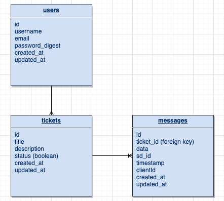

# TT_Ticket_Tracker

## Overview

[Current Deploy](https://601aa0d46dd2fc00089a2496--tt-chat-ticket-tracker.netlify.app/)
Need more styling, but functionality is working.

[TT Ticket Tracker](https://github.com/jeri-dilts/TT_Ticket_Tracker) is a full-stack application built with ReactJS and a Ruby on Rails server. A JWT authentication system is built into the design for an added layer of complexity.

This app is a chat / ticket mangement system. The admin has the ability to chat with someone about an issue using a 3rd party platform Scaledrone, a realtime mesaging service. If the problem is unresolved or if the admin would like to keep the ticket for their records, the chat can be saved. This saving process will require a title and description of the issue and given a status (open || closed). The admin will have view where they can see all tickets. If they click a ticket they can see the chat thread, title, description, and status. They will also be able to edit and update the description, title, and status || delete ticket entirely.

## MVP
### Server (Back End)

- Have a RESTful JSON API.
  - Build a Ruby on Rails server, exposing RESTful JSON endpoints.
  - Build a database with at least 3 tables:
    - 1:m table association between ticket and status tables (user is the third table)
  - Utilize Rails to define models for interacting with the database.
  - Implement working generic controller actions for Full CRUD (`index`, `show`, `create`, `update`, `delete`) between your non-User tables 

### Client (Front End)

- Have a working, interactive React app, built using `npx create-react-app`.
  - Have at least 8 separate, rendered components in an organized and understandable React file structure.
  - Utilize functional and class React components appropriately.
  - Utilize state and props in the components efficiently.
  - Use _only_ React for DOM Manipulation.
- Consume data from Ruby on Rails API, and render that data in the components.
- Utilize React Router, for client-side routing.
- Demonstrate Full CRUD actions ( `index`, `show`, `create`, `update`, and `delete` ) on the front end.

### Styling

- Be styled with CSS (or SCSS).
- Use Flexbox or Grid in your layout design.
- 2 media queries for responsive design on 3 screen sizes (including desktop).

### Linting

- Indent properly.
- Utilize high-quality, semantic variable names.
- Follow `camelCase`, `snake_case`, and `kebab-case` convention.
- Remove unnecessary boilerplate React files and code.
- Remove all `console.log()`s and commented out code 

### Deployment

- Deploy the fully functional front-end via Netlify.
- Deploy the back-end via Heroku.
- Deploy early and often(this will help to debug small issues before they become large issues)

### Procedural

- Initialize a git repo on Github, with a link to your hosted project.
- Have frequent commits, making a _robust_ commit history at least every day. (75 commits minimum)
- Use effective and safe branching and merging processes.

### Libraries and Dependencies
|     Library      | Description                                |
| :--------------: | :----------------------------------------- |
|      React       | JS library used to build responsive web interfaces|
|   React Router   | navigational component library             |
| React SemanticUI | beautiful responsive develeopment framework|
|    Scaledrone    | a 3rd party realtime messaging service       |

### Client (Front End)

#### Wireframes

#### Component Tree

### Server (Back End)

#### ERD Model

 

***

## Post-MVP
- To be able to sort tickets by status
- Create a hook for the handle change
- Have multiple user types